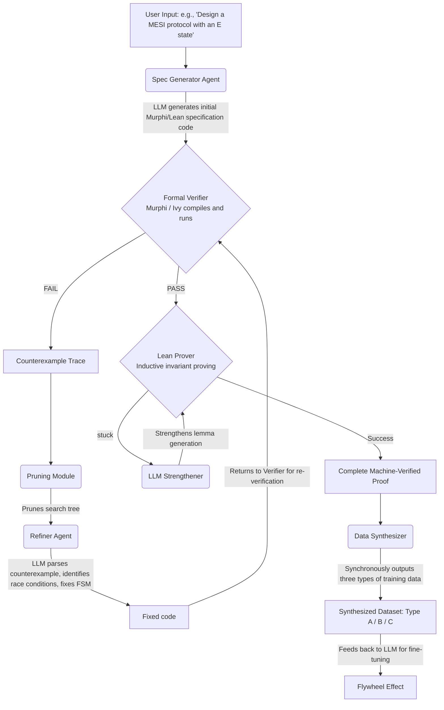

# Coherence Pilot

**Coherence Pilot** is an end-to-end autonomous framework combining LLM + Agents with formal verification (model checking + theorem proving). It aims to solve the complexity of cache coherence protocol proofs, enabling automated proving and high-quality data generation.

## 🎯 Goals

- Build an LLM + Agent end-to-end autonomous framework to achieve automated proofs for cache coherence protocols.
- Combine the generative capabilities of large language models with the rigorous verification capabilities of formal methods to break through the bottleneck of complex protocol verification.
- Automatically produce high-quality training data to feed back into LLM domain fine-tuning.

---

## 💡 Core Innovations

### 1. Lean + Murphi Cross-Validation Feedback Loop
Connects bounded model checking (Murphi) with interactive theorem proving (Lean 4) in a bi-directional feedback loop:
- **Murphi Fast Filtering**: Candidate invariants generated by the LLM are first checked via Murphi on finite instances (in seconds). Counterexamples are fed back to the LLM for correction.
- **Lean Stuck State Driven Strengthening**: When a Lean proof gets stuck, the unfinished proof obligations are fed back to the LLM to trigger lemma strengthening or decomposition.
- **Complementarity**: Their combination covers each other's blind spots. Murphi excels at finding counterexamples, while Lean provides complete proofs.

### 2. Counterexample-Driven Search Space Pruning
- **Counterexample Variable Extraction Pruning**: Extracts key variables from Murphi counterexamples to compress the search space for subsequent candidate invariants.
- **Failure Pattern Recording**: Maintains structural features of explored failed subtrees to prevent the LLM from repeatedly generating isomorphic incorrect candidates.

### 3. Verification-Driven High-Quality Data Synthesis
Automatically produces three types of high-quality training data during the verification loop:
- **Type A (Debugging CoT)**: Derived from failed verification paths, containing incorrect code, traces, and chain-of-thought correction processes.
- **Type B (State Reasoning)**: Derived from state space traversal, containing state transitions and rule rationales.
- **Type C (Invariant Data)**: Derived from protocol-invariant pairs and natural language explanations when proofs succeed.

---

## 🏗️ Framework Structure



---

## 🚀 Quick Start

### Dependency Installation

```bash
pip install -r requirements.txt
```
*(Note: Running the full pipeline requires configuring Murphi and Lean 4 environments on your system)*

### Run Framework

```bash
python main.py
```

Upon execution, the core orchestrator (`orchestrator.py`) will start the bi-directional feedback loop between Agents and Verifiers, ultimately outputting the verification results and synthesized data volume to the console.

### Run as MCP (Model Context Protocol)

To allow large language models (such as Claude Desktop or Cursor and other MCP-supported clients) to **autonomously and dynamically** invoke formal verification tools, we provide a standard MCP Server wrapper. This replaces the traditional static compiled script approach, allowing large models to perform automated theorem proving and protocol verification interactively.

Start MCP Server:

```bash
python mcp_server.py
```

**Core Tools provided by MCP Server:**
- `run_murphi_check`: Compiles and runs a Murphi model. When encountering an Invariant Violation, it automatically parses the verbose output to extract **State Deltas**, avoiding LLM context overflow.
- `run_lean_proof`: Executes a Lean 4 script. Not only does it return the compilation result, but when the proof is stuck, it extracts and returns the precise **Tactic State (Unsolved Goals)** to guide the large model's next strategic reasoning steps.
- `run_ivy_check`: Executes an Ivy inductive invariant check. When invariants are not inductive, it automatically extracts **CTI (Counterexample To Induction)**, pinpointing the state and action causing the induction failure.
- `parse_counterexample_trace`: Structures the existing raw Murphi text output into a JSON Trace.

---

## 📂 Directory Structure

- `main.py`: Entry point file
- `core/`: Core orchestrator, connecting the entire feedback loop
- `agents/`: Collection of LLM Agents (Generation, Refinement, Strengthening)
- `verifiers/`: Formal tool interfaces (Murphi, Lean)
- `pruning/`: Counterexample and state space pruning module
- `data_synth/`: Training data synthesis engine
